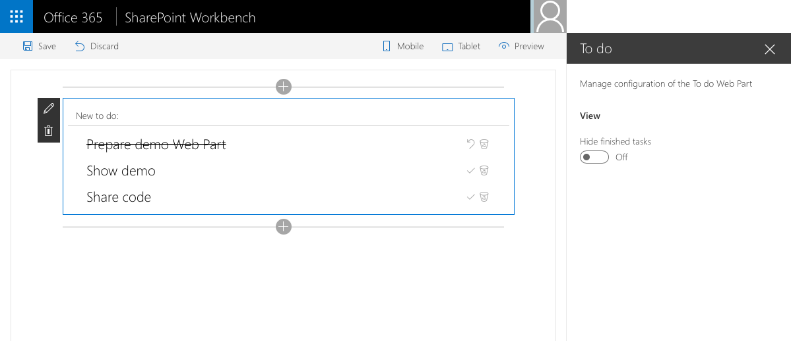

# Angular client-side web part

## Summary

Sample Web Part illustrating using Angular with the SharePoint Framework.

## Used SharePoint Framework Version 

## Applies to

* [SharePoint Framework](http://dev.office.com/sharepoint/docs/spfx/sharepoint-framework-overview)
* [Office 365 developer tenant](http://dev.office.com/sharepoint/docs/spfx/set-up-your-developer-tenant)

## Solution

Solution|Author(s)
--------|---------
angular-todo|Waldek Mastykarz (MVP, Rencore, @waldekm)

## Version history

Version|Date|Comments
-------|----|--------
1.0|March 10, 2017|Initial release

## Disclaimer
**THIS CODE IS PROVIDED *AS IS* WITHOUT WARRANTY OF ANY KIND, EITHER EXPRESS OR IMPLIED, INCLUDING ANY IMPLIED WARRANTIES OF FITNESS FOR A PARTICULAR PURPOSE, MERCHANTABILITY, OR NON-INFRINGEMENT.**

---

## Minimal Path to Awesome

* clone this repo
* in the command line run:
  * `npm i`
  * `gulp serve`

## Features

The To do web part is a sample client-side web part built on the SharePoint Framework built using Angular.

This web part illustrates the following concepts on top of the SharePoint Framework:

* using Angular v1.x with TypeScript for building SharePoint Framework client-side web parts
* loading Angular from CDN
* using Office UI Fabric CSS styles in a SharePoint Framework client-side web part
* using non-reactive web part property pane
* using conditional rendering for one-time web part setup
* passing web part configuration to Angular and reacting to configuration changes

